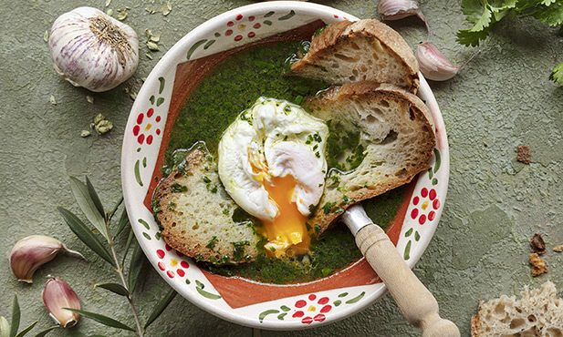

## Açorda à Alentejana
###### dose: 4 pax
- Ingredientes
- 1 bom molho de coentros
    - (ou um molho pequeno de poejos ou uma mistura das duas ervas)
- 4 dentes de alho
- 1 colher de sopa bem cheia de sal grosso
- 4 colheres de sopa de azeite
- 1,5 litro de água a ferver
- 400 grs de pão caseiro (duro, do dia anterior)
- 4 ovos

#### Confecção
Pisam-se num almofariz, reduzindo-os a papa, os coentros (ou os poejos) com os dentes de alho, a que se retirou o grelo, e o sal grosso. Deita-se esta papa na terrina ou numa tigela de meia cozinha, que neste caso fará ofícios de terrina. Rega-se com o azeite e escalda-se com a água a ferver, onde previamente se escalfaram os ovos (de onde se retiraram). Mexe-se a açorda com uma fatia de pão grande, com que se prova a sopa. A esta sopa dá-se o nome de sopa «azeiteira» ou «sopa mestra». Introduz-se então no caldo o pão, que foi ou não cortado em fatias ou em cubos com uma faca, ou partido à mão, conforme o gosto. Depois, tapa-se ou não a açorda, pois uns gostam dela mole e outros apreciam as suas sopas duras. Os ovos são colocados no prato ou sobre as sopas na terrina, também conforme o gosto. *A açorda é, fora do Alentejo, o prato mais conhecido da culinária alentejana. Vai à mesa do pobre e do rico e raro é o dia que não constitui o almoço do trabalhador rural. Tem muitas variantes, mais influenciadas pela mudança de estações do que, como é regra em cozinha trdicionais, de terra para terra. É sempre um caldo quente e transparente, aromatizado com coentros ou poejos, ou os dois, alhos pisados com sal grosso e condimentado com azeite. Dão-lhe consistência fatias ou bocados de pão de trigo, de preferência caseiro e duro. Acompanha-se geralmente com ovos escalfados, que também podem ser cozidos, e azeitonas. Muitas vezes, na água utilizada já se cozeu uma posta de pescada ou de bacalhau. Também pode ser acompanhada com sardinhas assadas ou fritas e, no Outono, é muitas vezes enriquecida com tiras finas de pimento verde, que se escaldam com a água ao mesmo tempo que as ervas, e acompanhada com figos maduros ou um cacho de uvas brancas de mesa.

