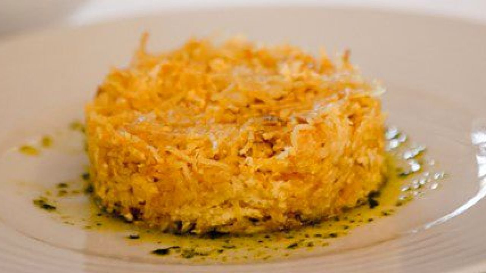

# Bacalhau Dourado
###### dose: 4 pax
#### Ingredientes
- 400 grs. de bacalhau demolhado
- 4 cebolas médias cortadas em meias-luas finas
- 400 grs. de batatas
- 3 dl de azeite
- 2 dentes de alho picados
- 5 ovos
- sal q.b.
- pimenta q.b.
#### Confecção 
Coza o bacalhau cerca de 1 minuto num tacho com bastante água.
Retire o bacalhau e desfaço-o, na mesma água coza as batatas, descascadas, até ficarem macias, corte-as em rodelas.
Em seguida, numa frigideira aqueça o azeite e nele refogue as cebolas e os alhos.
Num tabuleiro de preferência de barro, coloque uma camada feita com metade do refogado da cebola, disponha por cima outra camada com metade das batatas e sobre esta distribua metade da porção do bacalhau, tempere de sal e pimenta e continue a sobrepor camadas até acabar os ingredientes.
Num recipiente bata os ovos com um pouco de sal, pimenta e deite sobre o preparado de bacalhau.
Leve ao  forno até que superfície esteja dourada.
Sirva bem quente.

