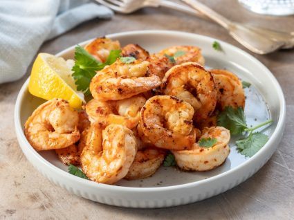

## Gambas ao Alhinho

###### Dose: 4pax

### Ingredientes

- 1 kg de gambas cruas
- 1 cabeça de alhos (grandes e cor-de-rosa)
- 4 malaguetas de piripiri
- 2 dl de azeite
- 4 colheres de café de molho inglês
- 4 colheres de chá de vinagre
- sal
- pimenta

### Confecção

\*Junte um pouco de uísque e substitua o vinagre por sumo de limão.
Substitua as gambas por tirinhas de lulas ou de chocos pequenos.
Deixe fritar até ficarem macias.
Este prato pode ser feito com as gambas cozidas e descascadas, mas o resultado é muito inferior, além de render menos.

CONFLITO
