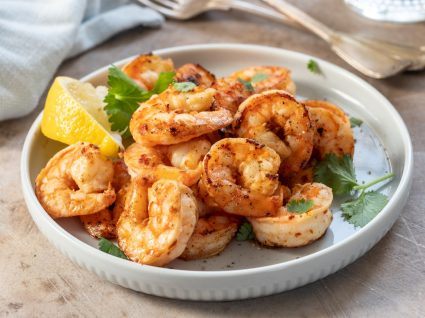

# Gambas ao Alhinho
###### dose: 4 pax
#### Ingredientes
- 1 kg de gambas cruas
- 1 cabeça de alhos (grandes e cor-de-rosa)
- 4 malaguetas de piripiri
- 2 dl de azeite
- 4 colheres de chá de vinagre
- sal
#### Confecção 
Corte as barbas e os olhos às gambas.
Abra a carapaça com uma tesoura, pela a parte das patas e descasque-as, deixando as cabeças agarradas.
Corte os dentes de alho em rodelas, abras as malaguetas e retire-lhes as sementes.
Divida o azeite por 4 caçarolinhas, deixe aquecer bem e deite, de cada uma delas, 1/4 da porção dos alhos, da malagueta e uma quarta parte das gambas cruas.
Deixe fritar 7 a 8 minutos.
Junte o molho inglês, o vinagre, sal e pimenta.
Sirva bem quente.

*Junte um pouco de uísque e substitua o vinagre por sumo de limão.
Substitua as gambas por tirinhas de lulas ou de chocos pequenos.
Deixe fritar até ficarem macias.
Este prato pode ser feito com as gambas cozidas e descascadas, mas o resultado é muito inferior, além de render menos.

